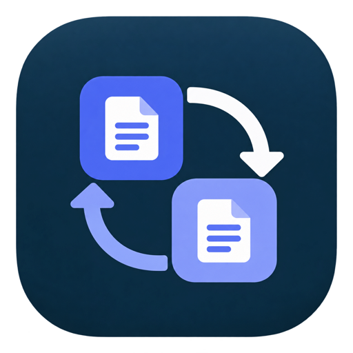

<p align="center">
  
</p>

<h1 align="center">Claude Sync</h1>

<p align="center">
  Move your claude.ai Projects from one account to another.<br />
  Desktop app for macOS and Windows, plus a command-line tool.
</p>

<p align="center">
  
</p>

<p align="center">
  <a href="https://github.com/ossmalaysia/claude-sync/actions/workflows/build.yml"></a>
  <a href="LICENSE"></a>
</p>

---

Switching from a personal claude.ai account to a team account, or between two
organizations? claude.ai has no way to import Projects, and the official data
export leaves out knowledge-file contents. Claude Sync copies them for you:

- Project name, description and visibility
- Project instructions
- Text knowledge docs, with their full content
- Uploaded knowledge files, byte for byte (images: see [limitations](#limitations))
- **Artifacts from your chats** (and files Claude wrote), at their final version:
  added as docs to the matching Project, and saved as readable files locally
- **Your own skills**, with every file they contain (built-in Anthropic skills
  are not copied)
- **Memory**, sent through claude.ai's memory import
- **Chats as documents** (optional, off by default): each chat in a Project is
  added to that Project as a transcript
- **What to copy**: after the first download, one page with a switch for each
  kind of content; reopen it any time from **Settings**
- **Keeps up**: *Scan & sync changes* sends only what is new since last time

> [!IMPORTANT]
> Claude Sync is an independent open-source project. It is **not affiliated
> with, endorsed by, or supported by Anthropic**. It uses claude.ai's
> undocumented web API through a real browser window, so it can break when
> claude.ai changes. Automated use may conflict with the claude.ai Terms of
> Service: read them, and use this tool at your own risk.

## How it works

You log in to both accounts in browser windows the app opens. Claude Sync never
sees your password. Then:

1. **Download from source.** Everything is copied to a folder on your computer.
   Your old account is only read, never changed.
2. **Choose what to copy.** Switch artifacts, chats, skills, memory and
   personal projects on or off, and tick the Projects to move. Projects named
   `Personal:…`, `Family:…` or `Travel…` start unticked.
3. **Send to target.** Projects are created one request at a time. Existing
   content in the target is never edited or deleted.
4. **Check the target.** Doc and file counts are compared with your local copy.

Pull and push can be stopped at any time and resumed later. Progress is saved
after every step, so a resumed push never creates duplicates. The home screen
always shows the real state, even after a restart.

**New here? Follow the [user guide](docs/USER_GUIDE.md)**, which has screenshots
of each step. See [docs/ARCHITECTURE.md](docs/ARCHITECTURE.md) for the design.

## Install

Download the latest build from
[Releases](https://github.com/ossmalaysia/claude-sync/releases) (or the
artifacts of the latest [build](https://github.com/ossmalaysia/claude-sync/actions/workflows/build.yml)).

Requirements: macOS 10.13+ or Windows 10/11, with **Google Chrome** or
**Microsoft Edge** installed. Set `CLAUDE_SYNC_BROWSER` to use another
Chromium-based browser.

Builds are not code-signed yet:

- **macOS:** right-click *Claude Sync.app* and choose **Open**.
- **Windows:** see the note below.

### Note for Windows users

Pick one download:

- `Claude-Sync-Windows-installer.exe` installs Claude Sync with a Start menu
  entry and an uninstaller.
- `Claude-Sync-Windows.exe` is the app itself: no install, just run it.

The first time you run either, Windows shows **"Windows protected your PC"**
with *Unknown publisher*. That is Microsoft Defender SmartScreen reacting to an
app that is new and not yet code-signed, not a virus warning. Click
**More info**, then **Run anyway** (if you only see **Don't run**, click
**More info** first). Windows remembers the choice for that file.

If you want to check that your download is the one built by this repository,
compare its hash with `SHA256SUMS.txt` on the release page. In PowerShell:

```powershell
Get-FileHash .\Claude-Sync-Windows-installer.exe -Algorithm SHA256
```

Your company's IT may block unsigned apps entirely; in that case ask them to
allow it, or wait for signed releases. Windows builds will be signed through
[SignPath Foundation](#code-signing-policy), after which the warning shows the
publisher and goes away as the app gains reputation.

## Command line

The same engine is available as a CLI, useful for scripting or large moves:

```bash
go run ./cmd/claude-sync login  --account source     # log in and list org ids
go run ./cmd/claude-sync pull   --org <source-org>   # download (resumable)
go run ./cmd/claude-sync plan   --org <target-org>   # dry run, no network
go run ./cmd/claude-sync smoke  --org <target-org>   # check the target accepts writes
go run ./cmd/claude-sync push   --org <target-org>   # send (resumable)
go run ./cmd/claude-sync verify --org <target-org>   # compare counts
```

Edit `selection.json` in the data folder to choose projects from the CLI. The
app and the CLI share the same data, and a lock stops them running two jobs at
once.

## Limitations

- **Chats are not recreated as chats.** claude.ai cannot import conversations.
  Their artifacts are recovered instead, and chats can be copied as documents:
  those from Project chats are added to the matching Project; artifacts are
  all saved under `artifacts-export/` locally.
- Files that Claude produced by running code (for example a generated `.docx`
  or `.pptx`) and published artifact pages are not recovered.
- **Memory** is merged by claude.ai into the target's memory; it is sent once per
  change so it is not imported twice.
- **Images** have no downloadable original on claude.ai. The full-resolution
  preview is saved and uploaded as `<name>.webp` instead.
- Files larger than 30 MB are skipped and reported.

## Development

Requirements: Go 1.26+, Node 20+, and the [Wails](https://wails.io) CLI.

```bash
go install github.com/wailsapp/wails/v2/cmd/wails@latest
wails dev                              # run the desktop app with live reload
go test ./...                          # Go tests, no browser needed
(cd frontend && npm install && npm test)
wails build -platform darwin/universal # macOS app
wails build -platform windows/amd64    # Windows app (cross-builds from macOS)
```

Contributions are welcome. See [CONTRIBUTING.md](CONTRIBUTING.md).

## Privacy

Claude Sync collects no data. It has no telemetry, analytics or accounts of its
own, and it will not transfer any information to other networked systems unless
the user asks it to. It connects only to claude.ai, in a browser window on your
computer, to read the source account and write to the target account you
choose. Everything it downloads (projects, artifacts, skills, memory) and your
browser logins stay in a private folder on your computer; delete that folder to
remove them.

## Code signing policy

Windows releases are signed with free code signing provided by
[SignPath.io](https://about.signpath.io), certificate by
[SignPath Foundation](https://signpath.org). (Signing is being set up; v0.1.0 is
not signed yet.)

Only builds made by this repository's GitHub Actions workflow from its own source
are signed, and each signing request is approved by hand.

| Role | Who |
|---|---|
| Committers and reviewers | [Members of the claude-sync maintainers](https://github.com/ossmalaysia/claude-sync/graphs/contributors); changes from other contributors are reviewed in pull requests |
| Approvers | [@jazztong](https://github.com/jazztong) |

## License

[MIT](LICENSE). Developed by [Anchor Sprint](https://www.anchorsprint.com/).

"Claude" is a trademark of Anthropic, PBC, used here only to describe
compatibility. This project is not an Anthropic product.
