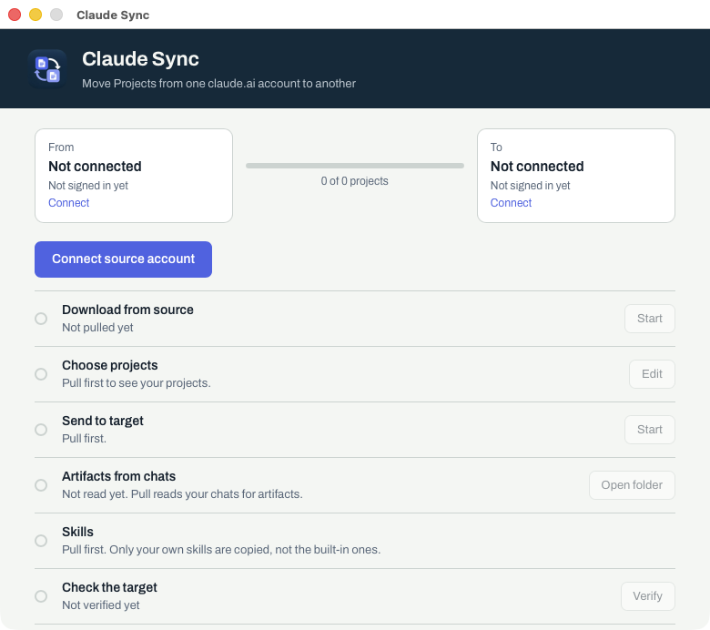
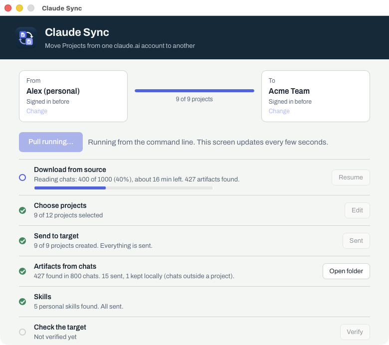
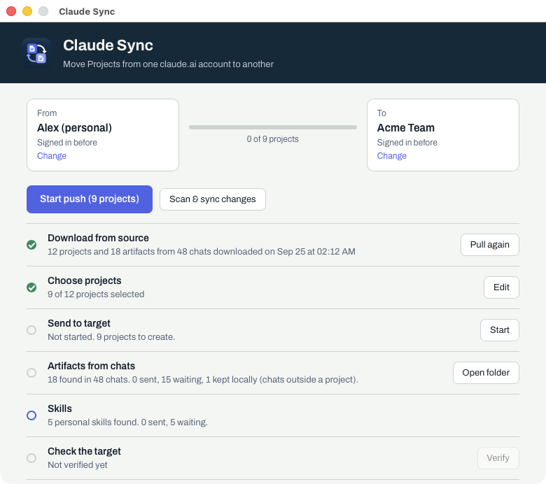
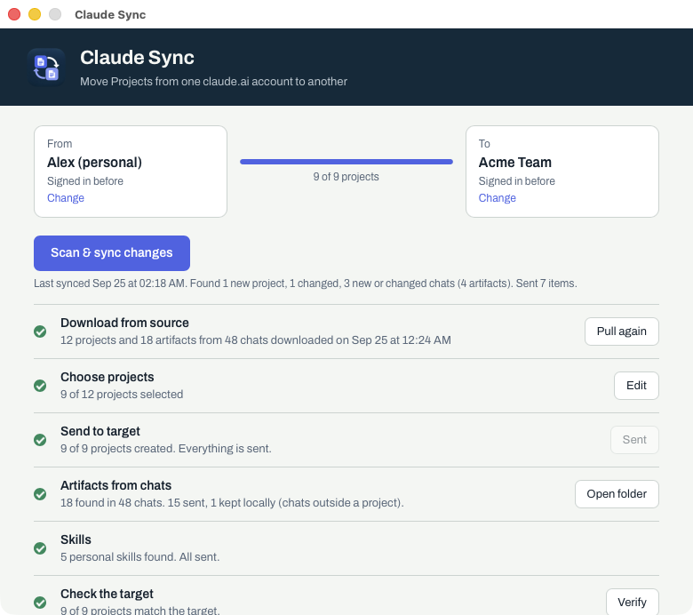

# Claude Sync user guide

Claude Sync copies your claude.ai Projects, the artifacts from your chats, your
own skills, and your memory from one account to another. For example, from a personal account
to your company's team account. This guide takes about ten minutes the first
time.

> Claude Sync is an independent open-source tool, not an Anthropic product. It
> uses claude.ai's web interface through a browser window, so it can stop
> working if claude.ai changes.

## 1. Install

**You need:** macOS 10.13 or later, or Windows 10/11, and **Google Chrome** or
**Microsoft Edge**.

Download the latest release from
<https://github.com/ossmalaysia/claude-sync/releases>:

| System | File | First launch |
|---|---|---|
| macOS (Apple Silicon and Intel) | `Claude-Sync-macOS.dmg` | Open the `.dmg` and drag **Claude Sync** to Applications. The app is not code-signed yet, so the first time, **right-click** it and choose **Open**, then **Open** again. |
| Windows | `Claude-Sync-Windows-installer.exe` | Run the installer. If SmartScreen says "Windows protected your PC", click **More info**, then **Run anyway**. |

## 2. Connect the account you are moving **from**

1. Click **Connect source account**. A Chrome (or Edge) window opens on claude.ai.
2. Log in to the account you are moving **from**, as you normally would.
   Claude Sync never sees your password. The login is saved in a private browser
   profile, so you only do this once.
3. Pick the organization if the account has more than one.

## 3. Download

Click **Start pull**. Claude Sync reads your source account (it never changes
it) and saves a copy on your computer:

- every Project with its instructions, docs and files
- the artifacts from your chats, at their final version
- your own skills, with every file they contain (built-in Anthropic skills are
  left out, since every account already has them)
- your memory

The first download can take a while if you have many chats. The screen shows
progress and the time left, and you can stop at any time: **Resume** continues
where it stopped.

## 4. Choose projects

Click **Edit** next to **Choose projects** and tick the Projects to move.
Projects whose names start with `Personal:`, `Family:` or `Travel` are unticked
by default. That matters when the target is a company account.

## 5. Connect the account you are moving **to**, then send

1. Click **Connect target account** and log in, in the second window (SSO works).
   Pick the organization, for example your team. Company SSO logins are often
   not remembered by the browser, so you may be asked to sign in again each time
   you start Claude Sync; that is expected.
2. Click **Start push**. Projects are created one request at a time, then your
   skills are uploaded. Nothing that already exists in the target is edited or
   deleted: a skill with the same name already in the target is left as it is.
   You can stop and resume.
3. When it finishes, **Check the target** confirms that every Project has the
   expected number of docs and files.
4. Next to **Memory**, click **Send**. claude.ai merges your memory into the
   target account in the background; it appears under Settings, Memory after a
   few minutes.

## 6. Keep them in sync

If you keep using the old account, click **Scan & sync changes** now and then.
It reads only what is new or changed since last time (usually under a minute),
sends it, and checks the Projects it changed. The line under the button says
what the last sync found and sent.

## Where things are, and what is not copied

- Your downloaded copy is in `~/Library/Application Support/claude-sync` (macOS)
  or `%AppData%\claude-sync` (Windows). **Open folder** next to *Artifacts from
  chats* shows readable copies of every artifact.
- **Chats** cannot be recreated in another account. Their artifacts are copied
  instead: artifacts from Project chats are added to the matching Project, and
  the rest stay in the local folder.
- **Images** in Project knowledge are copied as full-resolution WebP previews
  (claude.ai keeps no original).
- Published artifact pages, and files that Claude produced by running code (for
  example a generated `.docx`), are not copied yet.
- A skill or document you edit later in the old account is not re-sent; only
  new items are. Claude Sync lists such changes instead.
- Files larger than 30 MB are skipped and listed.

## Troubleshooting

| What you see | What to do |
|---|---|
| "No Chrome, Edge or Chromium found" | Install Google Chrome, or set `CLAUDE_SYNC_BROWSER` to another Chromium-based browser. |
| "login expired" or a browser window closed | Click the same button again and log in to the window that opens. Progress is kept. |
| Check the target says projects "only need their artifacts sent" | Those Projects are not selected, or a push has not run since the last pull. Choose them and push. |
| You want a trial run without touching your real data folder | Start the app with `CLAUDE_SYNC_DATA=/some/empty/folder`. |

Found a problem? Please open an issue:
<https://github.com/ossmalaysia/claude-sync/issues>. Remove project names, emails
and document contents from anything you paste.
